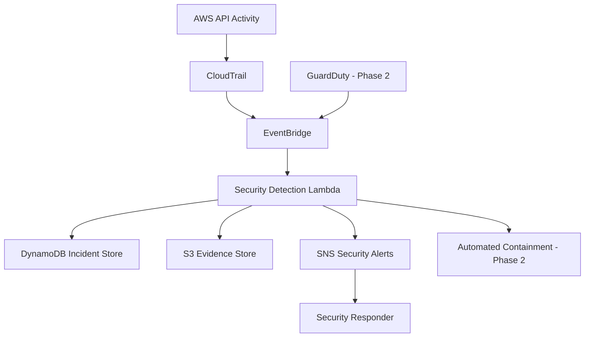

# AWS Cloud Incident Detection & Automated Response
\n**Status: ✅ Completed — v1.0 | 19 September 2026**

**Detect. Investigate. Preserve. Respond.**

AWS-native cloud security project designed to detect suspicious activity and dangerous configuration changes, create auditable security incidents, preserve forensic evidence, alert responders, and optionally perform automated containment for high-confidence threats.

## Problem

Cloud environments generate large volumes of security-relevant activity through IAM, CloudTrail, EC2, networking, storage, and other AWS services.

Organizations need a way to:

- Detect dangerous AWS API activity quickly.
- Preserve the original event as evidence.
- Enrich security events with actor, IP, account, region, and resource information.
- Assign consistent severity.
- Notify responders.
- Maintain an auditable incident record.
- Optionally automate safe containment actions.

This project implements a lightweight AWS-native detection and incident-response pipeline.

## Architecture

## Initial Detections

| Detection | Severity | Response |
|---|---|---|
| CloudTrail StopLogging | Critical | Alert + evidence preservation |
| CloudTrail DeleteTrail | Critical | Alert + evidence preservation |
| CloudTrail configuration modification | High | Alert + evidence preservation |
| Root account activity | Critical | Planned |
| Administrator privilege assignment | Critical | Planned |
| Public SSH/RDP exposure | High | Planned |
| IAM access key creation | Medium | Planned |
| GuardDuty findings | Variable | Planned |

## Technology

- AWS CloudTrail
- Amazon EventBridge
- AWS Lambda
- Amazon DynamoDB
- Amazon S3
- Amazon SNS
- AWS IAM
- Python
- Terraform

## Security Principles

- Least-privilege IAM
- Evidence preservation
- Detection before automated response
- Human approval for ambiguous events
- Auditable incident records
- Infrastructure as Code
- Defense-in-depth

## Disclaimer

This project is intended for controlled AWS lab environments. Automated containment must be thoroughly tested before being enabled in production.

## Deployment & Detection Evidence

The platform has been deployed and validated using both synthetic and real AWS API activity.

Testing confirmed:

- CRITICAL detection of simulated CloudTrail `StopLogging` activity.
- HIGH detection of a real `UpdateTrail` AWS API call.
- CloudTrail to EventBridge event routing.
- Lambda detection and incident normalization.
- S3 evidence preservation.
- DynamoDB incident recording.
- SNS email alert delivery.

See [`evidence/README.md`](evidence/README.md) for the deployment and testing evidence.

## Project Completion

Version **1.0** of this project was completed on **19 September 2026**.

The implemented platform demonstrates AWS-native detection engineering, incident normalization, evidence preservation, security alerting, GuardDuty integration, contextual false-positive reduction, and controlled automated containment.

Detailed completion notes are available in [`docs/PROJECT-COMPLETION.md`](docs/PROJECT-COMPLETION.md).

Future enhancements will be developed as a separate v2 rather than extending the scope of this completed version.
